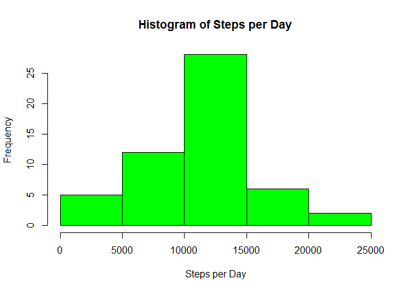
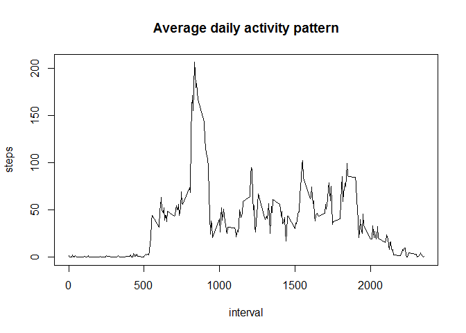

# Reproducible Research: Peer Assessment 1


## Loading and preprocessing the data
Data is loaded from https://d396qusza40orc.cloudfront.net/repdata%2Fdata%2Factivity.zip and unzipped

```r
activity <- read.csv("activity.csv")
library(plyr) # required for various functions
library(lattice) # needed for plotting
```

## What is mean total number of steps taken per day?

```r
cleanact <- activity[!is.na(activity$steps),]
perday<-count(cleanact,"date","steps")
hist(perday[,2], main="Histogram of Steps per Day", xlab="Steps per Day", col="green")
```

 

Mean and median values are as follows :

```r
mean(perday[,2])
```

```
## [1] 10766.19
```

```r
median(perday[,2])
```

```
## [1] 10765
```

## What is the average daily activity pattern?

```r
ag<-aggregate(steps ~ interval,data=activity, mean)
plot(ag,type="l", main="Average daily activity pattern")
```

 

```r
ags<-sort.list(ag[,2], decreasing=TRUE)
```
Interval (hhmm) where maximum average activity occurs :

```r
ag[ags[1],1]
```

```
## [1] 835
```

## Imputing missing values
Count of dataset rows with missing data :

```r
sum(is.na(activity[,1]))
```

```
## [1] 2304
```

```r
adjact<-join(activity,ag,by="interval")
adjact[is.na(adjact[,1]),1] <- adjact[is.na(adjact[,1]),4] # this overwrites NA's with average values, adjact is the new dataset
adjacty<-adjact[,1:3]
adjday<-count(adjacty,"date","steps")
adjday[is.na(adjday$freq)]<-0
```
Mean and median values are as follows :

```r
mean(adjday$freq)
```

```
## [1] 10766.19
```

```r
median(adjday$freq)
```

```
## [1] 10766.19
```
The values (for mean & median) shown are very similar as compared when there where still missing values so there is very little impact- this is not very surprising given the strategy to remove those.

## Are there differences in activity patterns between weekdays and weekends?

```r
adjactx<-adjact[,c(1,2,3,2)]
colnames(adjactx)[4]<-"dayofweek"
adjactx[,4]<-weekdays(as.Date(adjactx[,2]))
adjactx<-adjactx[,c(1,2,3,4,4)]
colnames(adjactx)[5]<-"typeofday"
adjactx[,5]<-"weekday"
adjactx[adjactx[,4]=="Saturday"|adjactx[,4]=="Sunday",5]<-"weekend"
adjactx[,5]<-factor(adjactx[,5])
agx<-aggregate(steps ~ interval + typeofday, data=adjactx, mean)
xyplot(steps ~ interval | typeofday, data=agx, layout=c(1,2), xlab="Interval", ylab="Number of steps", type="l")
```

 


